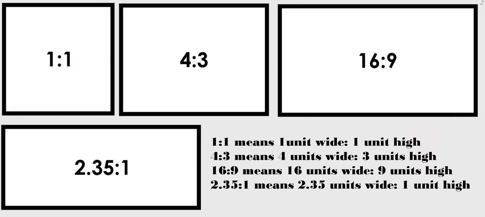
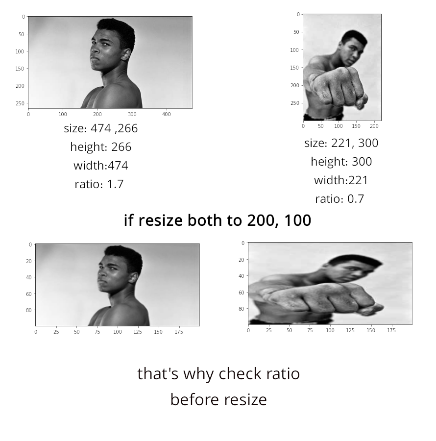

# Search Engines Image Scraper
You do want to find high quality image with custom setting? here is what you need with *Search Engines Image Scraper* You can easily find and download image with custom size , color and ratio.
Let's start and Start project if you want help to improve It's My honor to check Your pull request.


# Table of Content
1. requirement and installation
2. Usage  
    - Cli
    - Pythn module
3. Defindes
    - image ratio
    - image size
    - image color
    - table of paramters
    - Why DuckDuckGo?
4. helpful link


---
## requirement:
  1. python 3+ (it can use also for python 2 but need to change)
  2. python packges: selenium , numpy , cv2 

### install requirement (freeze version):
- install with `pip install -r requirement.txt'` or `pip3 install -r requirement.txt` 
---

# Usage:
## 1. CLI 
open Your shell in repo dir and enter (python3 also for some cases)
##### *CLI version just accept two paramanter*
`python image_scraper.py  --qeury string --amount int `


for sample here I am download amazon logo

`python image_scraper.py  --qeury "amazon logo" --amount 10 `

for get help wirte:

`python image_scraper.py -h`

## 2. python module
1. Import it as normal module
```python 
from image_scraper import Scraper_Config , Image_Scraper
```
2. Create config (also you can use default config)
```python 
config = Scraper_Config(SEARCH_QUERY = 'duckduckgo',
                 NUMBER_OF_PICTURES = 5,
                 IMAGE_RATIO = (16, 9),
                 IMAGE_SIZE = (200 , 100),
                 CHECK_RATIO_AND_RESIZE = False,
                 EPSILON_RATIO_ERROR = 0.5 ,
                 MAKE_GRAY = False,
                 SEARCH_ENGINE_TYPE='duckduckgo',
                 MINIMUM_ELEMENT_ERROR = 0.2,
                 SLEEP_TIME = 0,
                 SCROLL_PAUSE_TIME = 2)
```
3. Create Image_Scraper isntace and call **scrap** function

```python 
scraper = Image_Scraper(config)
scraper.scrap(verbose=True)
```


---
# Defindes
## aspect ratios
#### what is  aspect ratio and why is important?

Maybe you known aspect ratio in images but why is important to us?

Let's check an example, our task is find great mohammad ali picture from google or duckduckgo.

in this system you can easily define image ratio and which size if ratio with some gap is neer to ratio accept it else next one. look at paramter table for more details.

## parameter table for better config


| Parameter | Type | Usage | Example |
|--|--|--|--|
| SEARCH_ENGINE_TYPE  | one of 'google', 'duckduckgo' | Chose use which search engine | duckduckgo |
| NUMBER_OF_PICTURES | Int > 5 | how much will be amount of images | 5 |
| CHECK_RATIO_AND_RESIZE | Boolean | If *True* then check ratio and resize each image | True |
| IMAGE_RATIO | tuple each number | If CHECK_RATIO_AND_RESIZE true then need to spesify it what is ratio | (16, 9) |
| EPSILON_RATIO_ERROR | float greater than 0.1 | If CHECK_RATIO_AND_RESIZE true then need to check until how much bigger ratio can resize |
| GOOGLE_URL | String  | Url for open in browser  | as is in default |
| DUCKDUCKGO_URL | String  | Url for open in browser  |  as is in default |
| SCROLL_PAUSE_TIME | Int -> second  | Wait between every scroll for load in browser  | 2 (seconds) |
| PATH_OF_THIS_FILE | String -> path  | image_scraper.py file path  | as is in default |
| IMAGE_BASE_DIR | String -> path  | where image save  | as is in default |
| GOOGLE_DRIVER_PATH | Int -> second  | If need to stop for download every image then put greater than 1  | 10 (seconds) |
| GOOGLE_CHROME_DRIVER_PATH |String -> path  | Path of google chrome driver | as is in default  |
| IMAGE_RATIO_PERSENT | Float  | convert ratio to float number  | 1.7 as mohammd ali picture |
| MAKE_GRAY | Boolean  | If CHECK_RATIO_AND_RESIZE true then make images gray | False |
| MINIMUM_ELEMENT_ERROR | Float  | if you need 100 image then at least check exist of 120 image this var is gap between 100 to 120. also when check CHECK_RATIO_AND_RESIZE need up to 2 time more elemnt to check and download needed image with custom ratio   | 0.2 |
| MINIMUM_EMELMET | Int  | calculate number of minimum elemnt must be exist   | as is in default |
| HTML_EMELMT_CLASS_NAME | String -> html tag  | Html tag in page for check and donwload image  | 10 (seconds) |


## Why DuckDuckGo?
[duckduckgo](https://duckduckgo.com/) say "Privacy, simplified ..." why here I am not talking about **Privacy** here we need Scrap web. Google Check ip, Behivaer in Browser and almost all thing with **Privacy** option you can even scrap it with [TOR network](https://www.torproject.org/)
---
# helpful link
## some issue I got maybe helpful for you:
- FileNotFoundError: [Errno 2] No such file or directory: 'geckodriver': 'geckodriver'
[link 1 stackoverflow](https://stackoverflow.com/questions/50461779/geckodriver-executable-needs-to-be-in-path) - [link 2 askubuntu](https://askubuntu.com/questions/851401/where-to-find-geckodriver-needed-by-selenium-python-package
)

- [install last Chrome on ubuntu](https://gist.github.com/mrtns/78d15e3263b2f6a231fe)

- [install Chrome web driver ubuntu](https://medium.com/@gerrysabar/scraping-linkedin-profile-using-python-selenium-88cb64888cf
)
--
# todo list
- [ ] add more example 
- [ ] add google search engine
- [ ] add more browser driver 
- [ ] add batch image downloader
- [ ] add image instant augment
- [ ] add multi threading support
- [ ] add colab support and colab file exmaple
